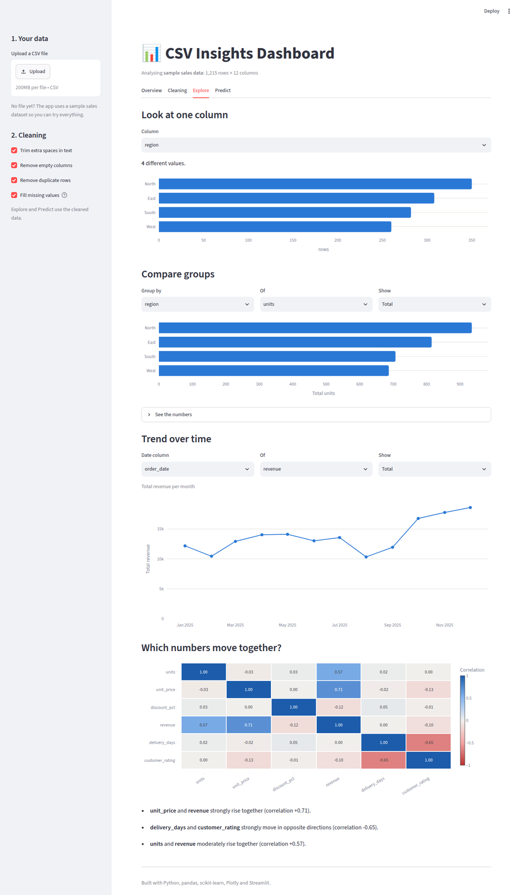
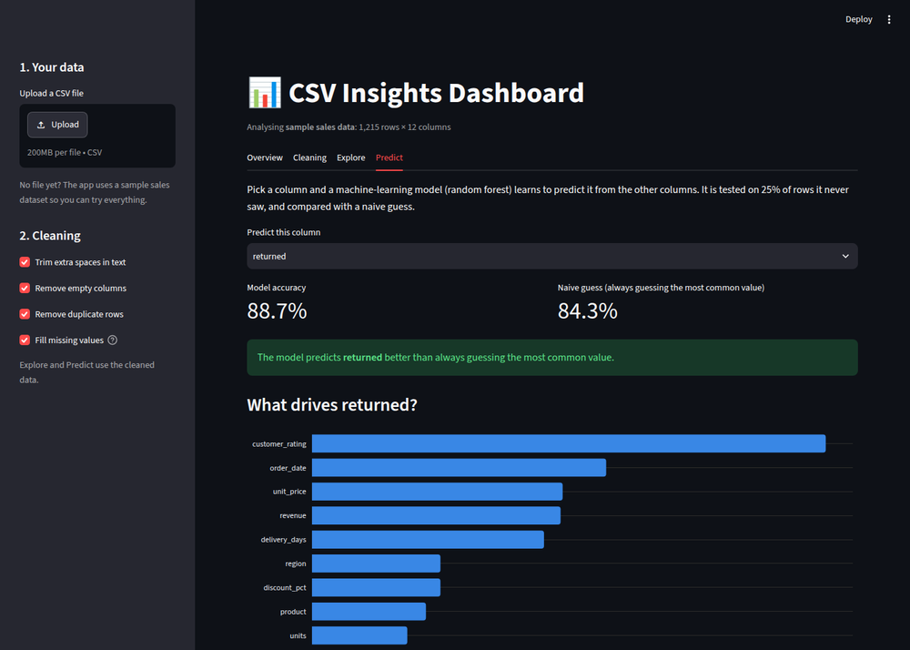

# 📊 CSV Insights Dashboard

Upload any CSV file and get, in seconds:

- **A health check**: rows, columns, missing values, duplicate rows, and what type each column is.
- **One-click cleaning**: trims stray spaces, removes duplicates and empty columns, fills missing
  values, and explains every change in plain English. Download the cleaned file.
- **Charts**: distributions, group comparisons (e.g. revenue by region), trends over time and a
  correlation heatmap, with the strongest relationships written out in words.
- **A prediction model**: pick any column and a random forest learns to predict it, compares itself
  honestly against a naive guess, and shows which columns drive the result.

No file handy? It opens with a sample year of sales orders so every feature can be tried.





## Run it locally

```bash
pip install -r requirements.txt
streamlit run app.py
```

Then open http://localhost:8501.

## Deploy it free (Streamlit Community Cloud)

1. Sign in at [share.streamlit.io](https://share.streamlit.io) with GitHub.
2. Click **Create app** → pick this repository and branch.
3. Set **Main file path** to `csv-insights-dashboard/app.py` and click **Deploy**.

You get a public link like `https://your-app-name.streamlit.app` to share.

## Project layout

| File | What it does |
|---|---|
| `app.py` | The Streamlit user interface (sidebar, tabs, charts) |
| `insights.py` | All data logic: loading, profiling, cleaning, grouping, model training. No UI code, so it is easy to test |
| `charts.py` | Plotly chart builders, styled for light and dark mode |
| `make_sample_data.py` | Generates `sample_data/sales.csv`, deliberately a little messy |
| `tests/` | Unit tests for the logic, plus a test that runs the whole app |

## Tests

```bash
pip install pytest
pytest
```

## Built with

Python · pandas · scikit-learn · Plotly · Streamlit
